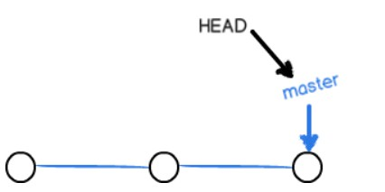

<!-- TOC -->

- [1. 新学功能](#1-新学功能)
    - [git fetch远程代码并合并](#git-fetch远程代码并合并)
    - [1.1. fork别人的代码 之后 更新与pull request](#11-fork别人的代码-之后-更新与pull-request)
    - [1.2. 撤销与覆盖](#12-撤销与覆盖)
- [2. 分支管理](#2-分支管理)
    - [2.1. 分支原理](#21-分支原理)
    - [2.2. 分支创建](#22-分支创建)
    - [2.3. 冲突合并](#23-冲突合并)
        - [2.3.1. 分支策略](#231-分支策略)
    - [2.4. git stash](#24-git-stash)
        - [2.4.1. 开发一个新feature，最好新建一个分支；](#241-开发一个新feature最好新建一个分支)
- [3. 标签管理](#3-标签管理)

<!-- /TOC -->

# 1. 新学功能

## git fetch远程代码并合并
需要从其他人的库里fetch代码 有选择的合并的时候   

git fetch remotename remotebranch:tmp  
git checkout master(切换到自己想要merge远程分支的本地分支)  
git diff tmp   
git  merge tmp  
git branch -d tmp  

如果只是从自己的库里fetch 和 merge  
git pull 


## 1.1. fork别人的代码 之后 更新与pull request
fork别人的代码  
git clone my_fork_link  
git remote add upstream othergit_link  

获取他人更新   
git pull upstream `<branch>`

向他人提交  pull request  
+ 先提交到自己的fork的仓库:git push origin `branch`
+ 在github上创建pull request即可

## 1.2. 撤销与覆盖

+ 远程覆盖本地代码

git fetch
git reset --hard origin master

+ git 撤销commit 但未push的代码

git log
git reset --hard(如果想保留修改内容而不是强制覆盖,则不加--hard) commitID

+ 撤销 为commit的修改

git status  

返回的英文里面告诉你了用什么命令撤回

+ rebase

git rebase -i HEAD~4 或者 git rebase -i  commitID(如果我想把1,2,3合并,我的commitId要写3的下一个,即4)

# 2. 分支管理
## 2.1. 分支原理
git的创建分支: HEAD指向dev,并继续发展




git的分支合并: 把master指向了dev,HEAD指向了master也指向了dev


## 2.2. 分支创建
```
vpsmaster@ubuntu:~/git$ git checkout -b dev #创建并切换到dev
Switched to a new branch 'dev'
vpsmaster@ubuntu:~/git$ git branch #查看当前的branch
* dev
  master
vpsmaster@ubuntu:~/git$ touch testbranch  #在dev分支上创建一个文件
vpsmaster@ubuntu:~/git$ ll
total 16
drwxrwxr-x  3 vpsmaster vpsmaster 4096 Jun 14 00:03 ./
drwxr-xr-x 29 vpsmaster vpsmaster 4096 Jun 13 23:34 ../
-rw-rw-r--  1 vpsmaster vpsmaster    0 Jun 13 23:00 file2
drwxrwxr-x  8 vpsmaster vpsmaster 4096 Jun 14 00:02 .git/
-rw-rw-r--  1 vpsmaster vpsmaster   12 Jun 13 23:06 readme.txt
-rw-rw-r--  1 vpsmaster vpsmaster    0 Jun 14 00:03 testbranch
-rw-rw-r--  1 vpsmaster vpsmaster    0 Jun 13 23:13 testrm
vpsmaster@ubuntu:~/git$ git add testbranch 
vpsmaster@ubuntu:~/git$ git commit -m "testbranch" 
[dev a8a027e] testbranch
 1 file changed, 0 insertions(+), 0 deletions(-)
 create mode 100644 testbranch
vpsmaster@ubuntu:~/git$ 

```
```
vpsmaster@ubuntu:~/git$ git checkout  master #切换回master分支
Switched to branch 'master'
Your branch is up-to-date with 'origin/master'.
vpsmaster@ubuntu:~/git$ git merge dev #把master分支合并
Updating 3b2e026..a8a027e
Fast-forward
 testbranch | 0
 1 file changed, 0 insertions(+), 0 deletions(-)
 create mode 100644 testbranch
vpsmaster@ubuntu:~/git$ ll #master分支下也拥有了testbranch文件
total 16
drwxrwxr-x  3 vpsmaster vpsmaster 4096 Jun 14 00:06 ./
drwxr-xr-x 29 vpsmaster vpsmaster 4096 Jun 13 23:34 ../
-rw-rw-r--  1 vpsmaster vpsmaster    0 Jun 13 23:00 file2
drwxrwxr-x  8 vpsmaster vpsmaster 4096 Jun 14 00:06 .git/
-rw-rw-r--  1 vpsmaster vpsmaster   12 Jun 13 23:06 readme.txt
-rw-rw-r--  1 vpsmaster vpsmaster    0 Jun 14 00:06 testbranch
-rw-rw-r--  1 vpsmaster vpsmaster    0 Jun 13 23:13 testrm
vpsmaster@ubuntu:~/git$ 
```
## 2.3. 冲突合并
创建分支dev2,修改了readme.txt
回到master,修改readme.txt
git merge dev2 后产生如下冲突
```
vpsmaster@ubuntu:~/git$ git merge dev2
Auto-merging readme.txt
CONFLICT (content): Merge conflict in readme.txt
Automatic merge failed; fix conflicts and then commit the result.

```
```
<<<<< HEAD
master
=======
dev2
>>>>> dev2
789
456
123

```
修改文件成如下就可以提交了
```
master dev2
789
456
123
```
```
git add readme.txt
git commit -m "merge master and dev2"

```
然后删除dev2
```
vpsmaster@ubuntu:~/git$ git branch -d dev2
Deleted branch dev2 (was e55d265).
```
### 2.3.1. 分支策略

分支策略
在实际开发中，我们应该按照几个基本原则进行分支管理：

首先，master分支应该是非常稳定的，也就是仅用来发布新版本，平时不能在上面干活；

那在哪干活呢？干活都在dev分支上，也就是说，dev分支是不稳定的，到某个时候，比如1.0版本发布时，再把dev分支合并到master上，在master分支发布1.0版本；

你和你的小伙伴们每个人都在dev分支上干活，每个人都有自己的分支，时不时地往dev分支上合并就可以了。

所以，团队合作的分支看起来就像这样：

## 2.4. git stash

```
vpsmaster@ubuntu:~/git$ git status
On branch dev3
Changes not staged for commit:
  (use "git add <file>..." to update what will be committed)
  (use "git checkout -- <file>..." to discard changes in working directory)

	modified:   readme.txt

Untracked files:
  (use "git add <file>..." to include in what will be committed)

	dev4
	dev5

no changes added to commit (use "git add" and/or "git commit -a")
vpsmaster@ubuntu:~/git$ git stash
Saved working directory and index state WIP on dev3: d66dade dev3
HEAD is now at d66dade dev3
vpsmaster@ubuntu:~/git$ vi readme.txt 
vpsmaster@ubuntu:~/git$ ll
total 20
drwxrwxr-x  4 vpsmaster vpsmaster 4096 Jun 14 01:29 ./
drwxr-xr-x 29 vpsmaster vpsmaster 4096 Jun 13 23:34 ../
-rw-rw-r--  1 vpsmaster vpsmaster    0 Jun 14 01:20 dev3
-rw-rw-r--  1 vpsmaster vpsmaster    0 Jun 14 01:21 dev4
-rw-rw-r--  1 vpsmaster vpsmaster    0 Jun 14 01:27 dev5
drwxrwxr-x  2 vpsmaster vpsmaster 4096 Jun 14 01:27 dev6/
-rw-rw-r--  1 vpsmaster vpsmaster    0 Jun 13 23:00 file2
drwxrwxr-x  8 vpsmaster vpsmaster 4096 Jun 14 01:29 .git/
-rw-rw-r--  1 vpsmaster vpsmaster   24 Jun 14 01:29 readme.txt
-rw-rw-r--  1 vpsmaster vpsmaster    0 Jun 14 00:06 testbranch
-rw-rw-r--  1 vpsmaster vpsmaster    0 Jun 13 23:13 testrm
vpsmaster@ubuntu:~/git$ git stash pop
On branch dev3
Changes not staged for commit:
  (use "git add <file>..." to update what will be committed)
  (use "git checkout -- <file>..." to discard changes in working directory)

	modified:   readme.txt

Untracked files:
  (use "git add <file>..." to include in what will be committed)

	dev4
	dev5

no changes added to commit (use "git add" and/or "git commit -a")
Dropped refs/stash@{0} (1c9c9f43a70df0a2d15685ba8ef323ff403e4672)
vpsmaster@ubuntu:~/git$ vi readme.txt 

```
### 2.4.1. 开发一个新feature，最好新建一个分支；

如果要丢弃一个没有被合并过的分支，可以通过git branch -D <name>强行删除。
# 3. 标签管理


